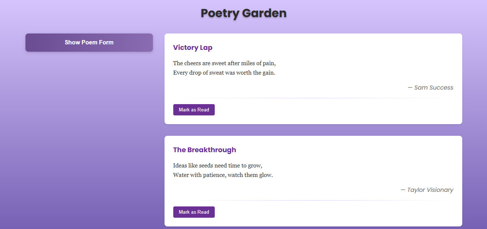

# Poetry Garden - A Simple Poem Management App

Poetry Garden is a clean, intuitive React application for managing and enjoying your favorite poems. With its two-panel layout, you can easily create, view, and organize your poetic masterpieces.



## Features
### Core features

- 📚 View Existing Poems: Browse through a collection of pre-loaded inspirational poems about success

- ✍️ Create New Poems: Add your own poetic creations with title, author, and content

- 📖Mark as Read/Unread: Track which poems you've read with a simple toggle

- 📱Responsive Design: Works well on both desktop and mobile devices
## Getting Started
### Core features
- Node.js (v14 or later)

- npm (v6 or later)

### Installation

1. Clone the repository:
``` shell
git clone git@github.com:Moringa-SDF-PT10/poesy-rowney-ouma.git
```
2. Navigate to the project directory:

``` bash
cd poesy-rowney-ouma
```
3. Navigate to the project directory:

``` bash
npm install
```

4. Navigate to the project directory:
``` bash
npm run dev
```
## Getting Started
1. View Poems: All poems are displayed in the right panel when you launch the app

2. Add New Poems:

- Click "Show Poem Form" in the left panel

- Fill in the poem details (title and content are required)

- Submit to add your poem to the collection

3. Mark as Read:

- Click "Mark as Read" below any poem

## Project Structure

<details>
<summary>🌳 Click to view file tree</summary>

```text
poetry-garden/
├── 📂 src/
│   ├── 💜 App.jsx             (Main component)
│   ├── 🎨 App.css             (Global styles)
│   ├── ⚛️ main.jsx            (React entry)
│   ├── 🖌️ index.css           (Base styles)
│   └── 📂 components/
│       ├── 📂 Poem/
│       │   ├── ✍️ PoemForm.jsx  (Form)
│       │   └── 🎨 PoemForm.css  (Styles)
│       └── 📂 PoemList/
│           ├── 📜 PoemList.jsx  (List)
│           ├── 🎨 PoemList.css  (Styles)
│           └── ✨ PoemItem.jsx   (Item)
├── 📂 public/                (Assets)
└── 📄 package.json           (Config)
```
</details>

## Technologies Used
- React

- CSS (with custom animations)

- Vite (build tool)

## Contributing
Contributions are welcome! Please follow these steps:
### 🚀 Advanced Deliverables Development

```bash
# 1. Fork the repository
git clone git@github.com:Moringa-SDF-PT10/poesy-rowney-ouma.git

# 2. Create feature branch
git checkout -b feature/AdvancedDeliverables

# 3. Stage and commit changes
git add .
git commit -m "feat: Implement advanced deliverables [Favorites+Deletion]"

# 4. Push to your fork
git push -u origin feature/AdvancedDeliverables

# 5. Open a Pull Request
# (Then visit GitHub to complete the PR process)
```
## License
Distributed under the [](LICENSE) license. 

## Contact
For questions or feedback, please contact: ``[oumarowney@gmail.com]``
Project Link: https://github.com/Moringa-SDF-PT10/poesy-rowney-ouma.git


